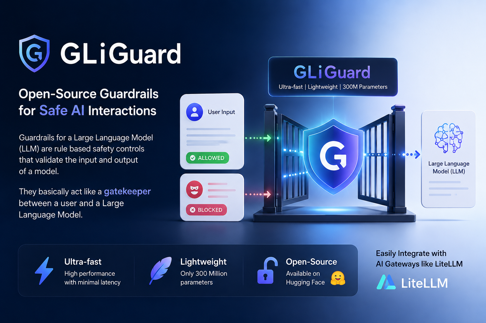

# Sundeep Machado's AI/ML Portfolio & Article Code

Hi there! 👋 Welcome to my AI/ML project repository.

This space is a living collection of my work in **Artificial Intelligence**, **Machine Learning**, and **Data Science**. It primarily serves as the official code repository for all the articles and tutorials I write on www.sundeepmachado.com

My goal is to bridge the gap between theory and practice by providing clean, well-commented code for the concepts I discuss.

---

## 🚀 Projects & Articles

Here is a list of my work. Each project includes a link to the relevant article (for the "why") and the source code (for the "how").

---

### 1. Serving an Embedding Model on NVIDIA Triton Server


* **Article:** 🔗 [Read the full article on my Blog](https://www.sundeepmachado.com/2025/10/how-to-deploy-googles-latest-embedding.html)
* **Description:** An embedding model is needed to generate embeddings (vector representations that help an LLM to understand things like text, images etc). 
Google recently released EmbeddingGemma-300M (a whooping 300 million parameter model) which has very low requirements to run. We test this assumption in this article.

* **Code:** 📂 [Find the code in the `/nvidia-triton-server/simple/google-embeddinggemma-300m` directory](./nvidia-triton-server/simple/google-embeddinggemma-300m)

---

### 2. How to Reduce CPU Spikes for AI Summarisation with Ollama


* **Article:** 🔗 [Read the full article on my Blog](https://www.sundeepmachado.com/2026/05/how-to-reduce-cpu-spikes-for-ai.html)
* **Description:** Long-form document summarisation with Ollama can cause sustained 100% CPU utilisation due to a prefill phase bottleneck. This article walks through the tuning parameters and Docker configuration that smooth out those spikes and keep the model responsive on CPU-only hardware.

* **Code:** 📂 [Find the code in the `/ollama/advance/ai-summarization-ollama-cpu-spike-prefill-phase` directory](./ollama/advance/ai-summarization-ollama-cpu-spike-prefill-phase)

---

### 3. How to Enable NVIDIA GPU Workloads on k3s


* **Article:** 🔗 [Read the full article on my Blog](https://www.sundeepmachado.com/2025/12/how-to-enable-nvidia-gpu-workloads-on.html)
* **Description:** By default, k3s nodes don't support GPUs. This tutorial walks through installing the NVIDIA driver and container toolkit, configuring k3s to use the NVIDIA container runtime, deploying the NVIDIA GPU Operator via Helm, and verifying GPU access with a test CUDA pod.

* **Code:** 📂 [Find the code in the `/k3s/simple/enable-nvidia-gpu-workloads` directory](./k3s/simple/enable-nvidia-gpu-workloads)

---

### 4. Adding a Custom Guardrail (GLiGuard) to a LiteLLM AI Gateway



* **Article:** 🔗 [Read the full article on my Blog](https://www.sundeepmachado.com/2026/06/custom-guardrail-gliguard-litellm-proxy.html)
* **Description:** Guardrails for a Large language model (LLM) are rule based safety controls that validate the input and output of a model. They basically act like a gatekeeper between a user and a Large language model.

GLiGuard is an open-source, ultra-fast and very light weight AI guardrail that has only 300 million parameters. It is available on HuggingFace and can be easily integrated on any AI Gateway like LiteLLM.

* **Code:** 📂 [Find the code in the `/concepts/simple/guardrail/adding-gliguard-litellm-ai-gateway` directory](./concepts/simple/guardrail/adding-gliguard-litellm-ai-gateway)

---

### More to come


## ⚙️ How to Use This Repository

1.  **Clone the repo:**
    ```bash
    git clone https://github.com/sjmach/artificial-intelligence.git
    ```
2.  **Navigate to a project:**
    Each project is self-contained in its own directory.
    ```bash
    cd [nvidia-triton-server]
    ```
3.  **Follow the instructions:**
    Every Project will have different set of instructions as mentioned in the pertaining article
